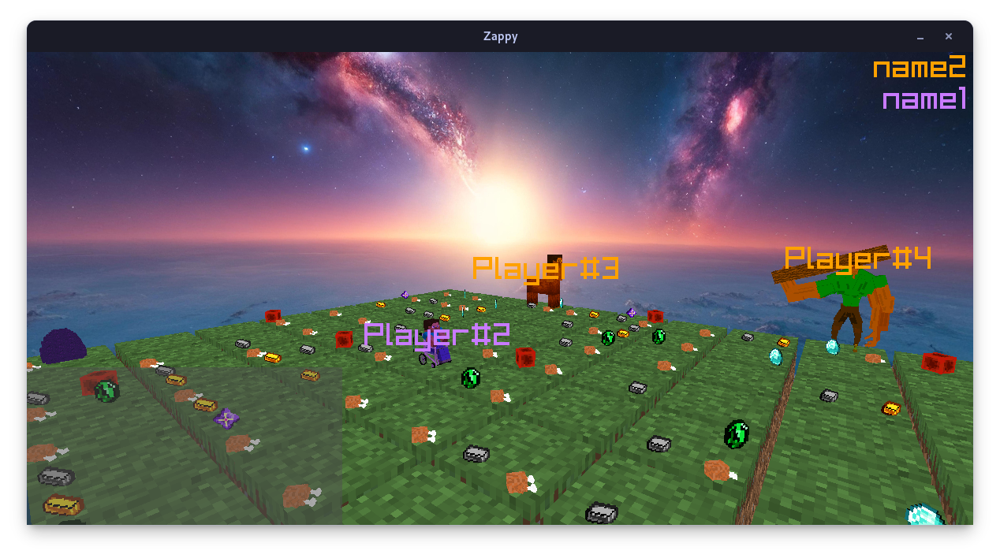

# 🗺️ Zappy 🎮



## Table of contents 📑

- [Description](#description-)
- [Usage](#usage-%EF%B8%8F)
- [Result](#result-)
- [Compilation](#compilation-%EF%B8%8F)
- [Documentation](#documentation-)
- [Organisation](#organisation-)
- [Contributors](#contributors-)


## Description 📝

The **Zappy** is a project carried out by **groups of 6** (see [Contributors](https://github.com/toro-nicolas/Jetpack/blob/main/README.md#contributors-)), during our **2nd year** in [**EPITECH**](https://www.epitech.eu/) Grand Ecole program.  
Its purpose is to create a network game where several teams confront each other on a tile map containing resources.  
The project involves developing a server in [**C**](https://en.wikipedia.org/wiki/C_(programming_language)), a graphical client in [**C++**](https://en.wikipedia.org/wiki/C%2B%2B), and an AI client with no language constraints.  

The game is set on a world called Trantor, which is a flat, tile-based map where players can move around, collect resources, and perform rituals to elevate their status.  
The winning team is the first one to have at least six players reach the maximum elevation level.  

Key features of the project include:  
- **Server**: Manages the game world, handles client connections, and enforces game rules.  
- **Graphical Client**: Provides a visual representation of the game world and actions.  
- **AI Client**: Autonomous clients that control players and make decisions based on the game state.  

For more information, please see the project specifications [here](resources/B-YEP-400_zappy.pdf) and [here](resources/B-YEP-400_zappy_GUI_protocol.pdf).


## Usage ⚔️

### AI

You can run the **AI** like this :
```sh
./zappy_ai -h machine -p port -n teamName
```
For more information, please see the help section.
```sh
> ./zappy_ai --help
USAGE:
        ./zappy_ai -h machine -p port -n teamName

OPTIONS:
        -h, --hostname          machine                 The hostname of the server
        -p, --port              port                    The port of the server
        -n, --name              teamName                The name of the team

META-OPTIONS:
        -H, --help                                      Display this help message
        -V, --version                                   Display the version of the program
        -A, --authors                                   Display the authors of the project
```


### GUI

You can run the **GUI** like this :
```sh
./zappy_gui -h machine -p port 
```
For more information, please see the help section.
```sh
> ./zappy_gui --help
USAGE:
        ./zappy_gui -h machine -p port 

OPTIONS:
        -h, --hostname          machine                 The hostname of the server
        -p, --port              port                    The port of the server

META-OPTIONS:
        -H, --help                                      Display this help message
        -V, --version                                   Display the version of the program
        -A, --authors                                   Display the authors of the project
```


### SERVER

You can run the **SERVER** like this :
```sh
./zappy_server -p port -x width -y height -n team1 team2 ... -c clientsNb
```
For more information, please see the help section.
```sh
> ./zappy_server --help
USAGE:
        ./zappy_server -p port -x width -y height -n team1 team2 ... -c clientsNumber

OPTIONS:
        -p, --port              port                    The port of the server
        -x, --width             width                   The width of the world
        -y, --height            height                  The height of the world
        -n, --names             name1 name2 ...         The names of the teams
        -c, --clients           clientsNumber           The number of clients per team
        -f, --frequency         frequency               The reciprocal of time unit for execution of action (default: 100)
        -s, --showEggs          true|false              Show eggs in the game (default: false)
        -e, --autoEnd           true|false              Automatically end the game when only one team remains (default: false)
        -i, --infiniteFood      true|false              Enable infinite food for players (default: false)
        -r, --noRefill          true|false              Disable resource refill on tiles (default: false)
        -d, --debugMode         true|false              Enable debug mode for debugging purposes (default: true)
        -l, --extraLogs         true|false              Enable extra logs for debugging purposes (default: false)
        
META-OPTIONS:
        -H, --help                                      Display this help message
        -V, --version                                   Display the version of the program
        -A, --authors                                   Display the authors of the project
```


## Result 🚩

The result of this project is a **perfect Zappy** with all the features requested in the specifications.  
If you discover a **problem** or an **error**, don't hesitate to **create an issue** and **report it** to us as soon as possible.


### Defense

TODO


## Compilation 🛠️

This project is compiled with **CMake** and **Makefile**.  
The compiler used is **GCC**, **G++** and **NASM**.  
This project uses **C 17** standard, **C++ 20** standard, **CMake 3.10** or higher and **Raylib 5.5** for the GUI.


### Compiling the project

You can compile the project with this command :
- via CMake and Makefile :
```sh
cmake -B build -S . && make -s -C build -j
```

If you want to debug the program, you can compile the project with this :
- via CMake and Makefile :
```sh
cmake -B build -S . -DDEBUG_MODE=ON && make -s -C build -j
```


### Unit tests

You can compile the unit tests with this command :
- via CMake and Makefile :
```sh
cmake -B build -S . && make unit_tests -s -C build -j
```

You can run the unit tests with this command :
- via CMake and Makefile :
```sh
cmake -B build -S . && make tests_run -s -C build -j
```


### Cleaning the project

If you want to clean the project, you can run this command :
- via CMake and Makefile :
```sh
cmake -B build -S . && make clean_all -s -C build -j
```


## Documentation 📚
The protocols documentation is accessible [here](docs/PROTOCOLS_DOCUMENTATION.md).  
The code documentation is accessible [here](docs/html/).

You can generate the documentation with this command :
- via CMake and Makefile:
```sh
cmake -B build -S . -DDOC_ONLY=OFF && make doc -s -C build -j
```
You need multiple packages to generate them :
- doxygen
- doxygen-latex
- doxygen-doxywizard
- graphviz


## Organisation 📦

Each task must be written in an issue of the **Github Project**.  
An issue should be as detailed as possible, with all fields filled in: type, priority, labels, etc.  

It is strictly **forbidden to push directly on the "main" branch**.  
All commits must be made on the "dev" branch or on a sub-branch of "dev".  
Try to push as little as possible on "dev", and prioritize associated branches (use the "gui" branch to push commits associated with the GUI).  
The main branches deriving from "dev" are: "ai", "gui", "server", "unit-tests" and "website".  
Branch names must be in kebab-case.  
You should prioritize making sub-branches of "dev" sub-branches, for example: "gui-end-scenes".  
Once the branch has been completed, it should be merged into "gui", then "gui" into "dev", then "dev" into "main" and all sub-branches of "dev".  

The commits must follow this [**policy**](docs/COMMITS_POLICY.md).  
Before pushing a commit, the coding style, compilation and unit tests must be verified.  
If the conditions are not met, we'll be notified by github actions!


## Contributors 👥

For this project, we were a group of **6 people**. Here are the people in the group:
- [Christophe VANDEVOIR](https://github.com/ItsKarmaOff)
- [Gianni TUERO](https://github.com/xJundo)
- [Lou PELLEGRINO](https://github.com/DimitriLaPoudre)
- [Nicolas TORO](https://github.com/toro-nicolas)
- [Olivier POUECH]()
- [Raphael LAUNAY](https://github.com/frenchkiwi)
